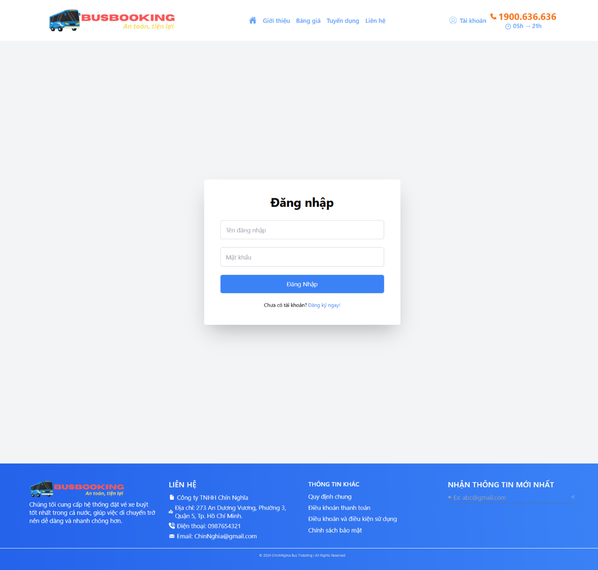

# bus-ticket-booking-management-backend

## Overview
### 1. Home page

### 2. Register

### 3. Login

### 4. Update Profile

### 5. Manage Profile

### 6. Change Password

### 7. Create Post

### 8. Update Post

### 9. Chat Message

### 10. Call Video

