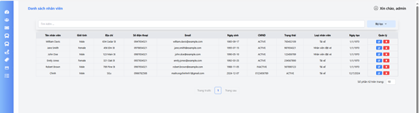
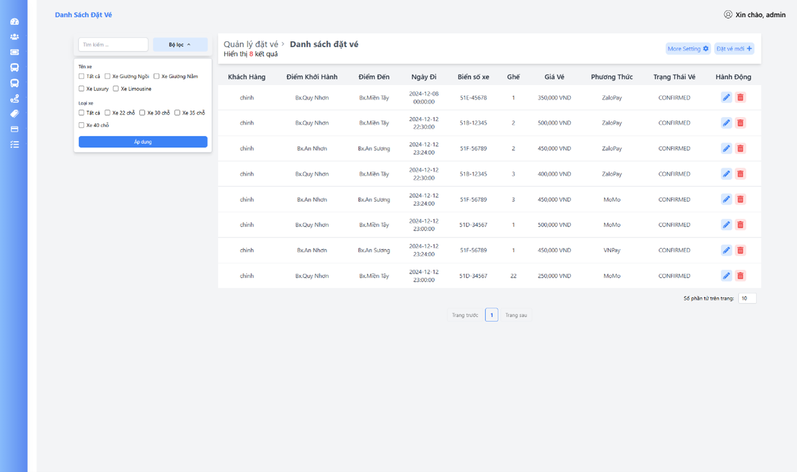

# bus-ticket-booking-management-backend

[Link code Frontend](https://github.com/MaiTrungChinhh/bus-ticketing-sys)

## Overview
### 1. Home page

### 2. Register

### 3. Login

### 4. Tra cứu vé

### 5. Chọn chuyến

### 6. Chọn ghế

### 7. Thanh toán

### 8. Dashboard

### 9. Quản lý nhân viên

### 10. Quản lý loại nhân viên

### 11. Quản lý khách hàng

### 12. Quản lý đặt vé

### 13. Quản lý chuyến xe

### 14. Quản lý chi tiết chuyến

### 15. Quản lý xe

### 16. Quản lý bảng giá

### 17. Quản lý phân công xe

### 18. Quản lý phân công chuyến

